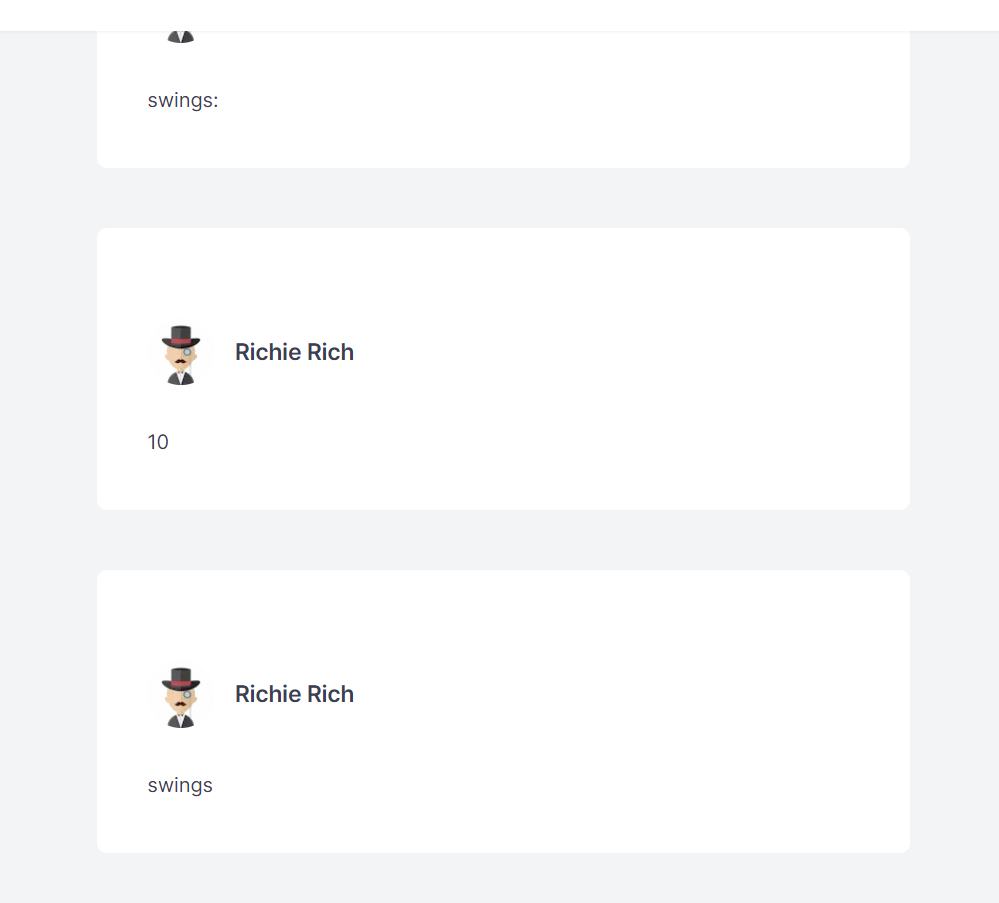

1.  If you were given 2 weeks time, what changes would you make to the project to enhance code quality, UX, performance, or scalability. This should not take more than ~15 minutes.

A: I would write unit tests for functions. Specically for opening and closing websockets.

I would also implement a chat history. Similar to chatGPT, you can see past chats and prompts. Implementing a history on the sidebar and being able to access and revisit chats and also continue them would be the next major feature I would implement. Smaller improvements would be the ability to stop the response from displaying and also the ability to scroll the page while the response is loading as well.

In terms of scalability, this app works fine with 1 user. As more and more users get added, I would try to explore connection pooling techniques to effeciently juggle the numerous WebSocket connections. I would also implement more efficient error handling to handle cases where the connection fails to open or if there is a server timeout.

2. In the 90 minutes given, I was able to hook up websockets successfully and reduce the latency for the responses to load on the frontend. The bug that I encountered was each word in the response getting its own text box and not loading 1 word at a time. In order to adhere to the rules that you've given, I just loaded the response all at once in order to display the response properly.

After the 90 minutes, I was able to implement some changes to addMessage in order to check if the last message sent and the agent matches the current agent, then it concatenates the current message to the last message. Otherwise it adds a new message object to the 'prevMessages' array with the current message contents.

After solving that problem, I ran into a new problem where a message and then a subsequent response wouldn't allow any more responses to show. There was some issues with websockets that closed connections and refused any new ones to be made. That problem was solved by adding some checks to handleSubmit in the frontend page.js.

I would check to see if the ws.current.readyState would be OPEN, if so, then send the prompt. If it wasn't I would open the websocket again and then send the prompt. I added some cleanup code to close the websocket connection on component unmount.

